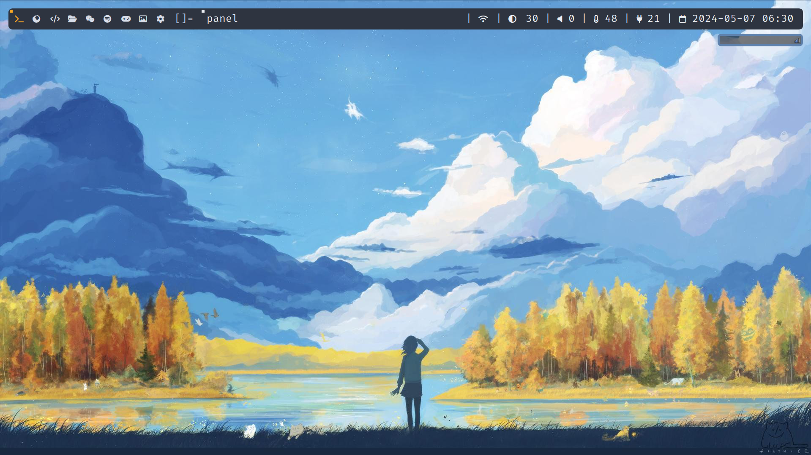
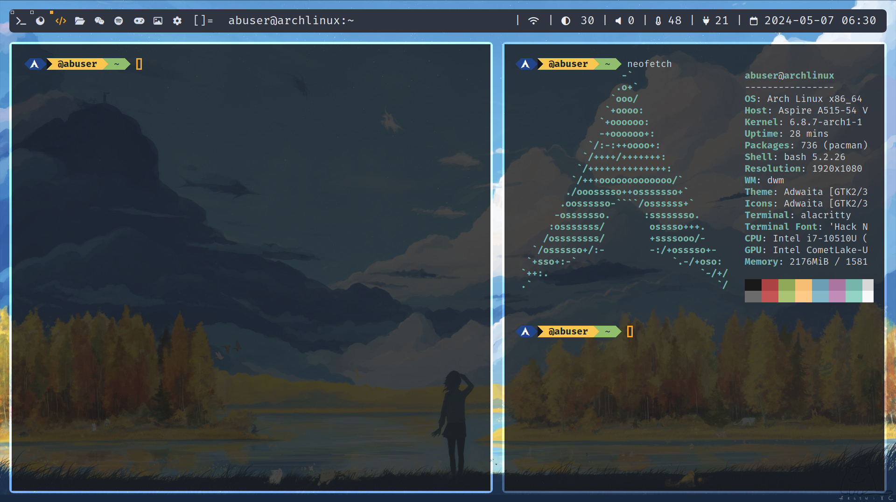

# My Arch Linux Desktop

Welcome to my Arch Linux desktop setup! This is a brief overview of my configuration, themes, and the tools I use to make my Linux experience smooth and functional.

## Desktop Preview



## Terminal - Neofetch



## System Details

- **OS**: Arch Linux x86_64
- **Host**: Aspire A515-54 V
- **Kernel**: 6.8.7-arch1-1
- **Uptime**: 28 mins
- **Packages**: 736 (pacman)
- **Shell**: bash 5.2.26
- **Resolution**: 1920x1080
- **Window Manager**: dwm
- **Theme**: Adwaita [GTK2/3]
- **Icons**: Adwaita
- **Terminal**: alacritty
- **Terminal Font**: Hack N
- **CPU**: Intel i7-10510U (8) @ 4.900GHz
- **GPU**: Intel CometLake-U
- **Memory**: 2176MiB / 1581MiB

## Featured Software

- **Terminal**: Alacritty
- **Text Editor**: NeoVim
- **File Manager**: Nemo
- **Web Browser**: Firefox

## Configuration Files

Feel free to explore my configuration files in this repository to adapt pieces of my setup to your own system.

### Installation Instructions

Follow these guidelines to replicate this setup or parts of it on your own machine.

### Step 1: Install Arch Linux

Start by installing Arch Linux. The official guide is comprehensive and updated regularly:
[Arch Linux Installation Guide](https://wiki.archlinux.org/title/Installation_guide)

### Step 2: Install dwm

**dwm** is a dynamic window manager for X. It manages windows in tiled, monocle, and floating layouts. All of the configurations are done through editing the source code, which makes it extremely fast and lightweight.

Here's how you can install dwm along with dmenu and st (simple terminal), which are also from suckless.org:

```bash
# Create a directory for suckless tools
mkdir ~/suckless
cd ~/suckless

# Clone and install dwm
git clone https://git.suckless.org/dwm
cd dwm
sudo make clean install

# Clone and install dmenu
cd ..
git clone https://git.suckless.org/dmenu
cd dmenu
sudo make clean install

# Clone and install st (optional)
cd ..
git clone https://git.suckless.org/st
cd st
sudo make clean install

## License

[MIT](LICENSE.md)

---

Enjoy my setup and feel free to start your own customization journey!

